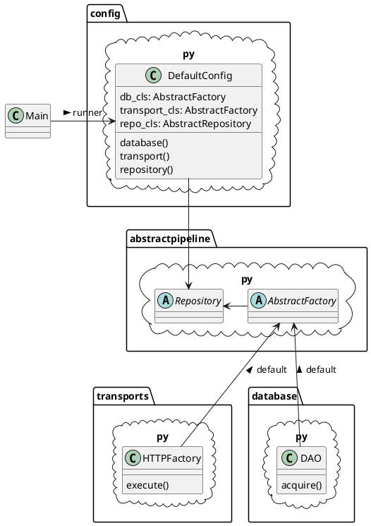

## AbstractClient
AbstractClient - это фрейворк для написания клиентов по работе с потоками данных между точками обслуживания.
Фреймворк написан с использованием подхода DI ([dependency injection](https://ru.wikipedia.org/wiki/%D0%92%D0%BD%D0%B5%D0%B4%D1%80%D0%B5%D0%BD%D0%B8%D0%B5_%D0%B7%D0%B0%D0%B2%D0%B8%D1%81%D0%B8%D0%BC%D0%BE%D1%81%D1%82%D0%B8)), 
что позволяет извне, на модульном уровне, изменять технологию работы с потоками, базами данных и логику их обработки.

В общем виде, структуру фреймворка можно представить в виде следующей диаграммы:


#### Main Class
DefaultConfig - Класс конфигуратор, принимающий при создании три типа классов для инжектирования:
- repo_cls (наследник AbstractRepository из abstractpipeline.py) - класс бизнес-логики. Обязательный параметр.
- db_cls (наследник AbstractFactory из abstractpipeline.py) - класс работы с базой данных. 
Если параметр не указан, будет присвоен реализованный класс по умолчанию - FirebirdFactory (database.py), 
для работы с базой Firebird.
- transport_cls (наследник AbstractFactory из abstractpipeline.py) - класс для работы с транспортным протоколом. 
Если не указан, будет присвоен реализованный класс по умолчанию - HTTPFactory (transport.py), для работы с протоколом HTTP.

Пример создания конфигуратора, с передачей только обязательного параметра - созданного репозитория ArticleImport, 
с единственным методом "Test":
```python
   class ArticleImport(AbstractRepository):
       @staticmethod
       def test():
           return "OK"

   # Создадим конфигуратор и передадим ему тип класса Репозитория. Остальные классы по умолчанию.
   config_object = DefaultConfig(ArticleImport)
```
>ВАЖНО ! Для работы фреймворка имеет большое значение названия класса репозитория 
(в вышеприведенном примере - ArticleImport), далее по тексту {repository_name}, 
которое затем используется при настройке ряда параметров. 

Для запуска фреймворка должны быть заданы несколько переменных окружения:

- ENV_FOR_DYNACONF = stage | production | development
- SETTINGS_FILE_FOR_DYNACONF = /path/to/{repository_name}.production.json
- Опционально ABSTRACTCLIENT_MODE=md | mm | mk | и т.п.

После запуска, конфигуратор DefaultConfig осуществляет настройку работы фреймворка по параметрам, которые должны 
находится в конфигурационном файле, путь к которму задан в переменной окружения SETTINGS_FILE_FOR_DYNACONF. 
Структура конфигурационных файлов построена по принципу работы [DYNACONF](https://dynaconf.readthedocs.io/en/latest/). 
Пример конфигурационных файлов приложения можно посмотреть для примера: [основной](test/settings.toml), 
[дополнительный](test/abstractclient.development.json). 
Дополнительный конфигурационный файл должен содержать две обязательные ветки, 
"transport" - для настройки транспорта и "database" - для настройки соединения с базой данных. 

Самым простым способом запуска фреймворка, явялется использование пакета Click для работы с интерфейсом коммандной 
строки, с передачей в него ранее созданного, с помощью конфигуратора DefaultConfig, экземпляра репозитория. 
Пример использования выглядит так:  
```python
   import click
   from abstractclient.defaultpipeline.config import DefaultConfig
   from .repository import MySuperBusinessLogic

   @click.group()
   def cli():
       pass

   @cli.command()
   @click.option('--method', type=click.Choice(['imports', 'export']), multiple=True, required=True)
   def run(method):
       for item in method:
           try:
               getattr(repository, item)()
           except Exception:
               continue

   if __name__ == "__main__":
       # Запустим конфигуратор и инжектируем необходимые классы работы с базой и бизнес-логики
       cfg: DefaultConfig = DefaultConfig(repo_cls=MySuperBusinessLogic)
       # Получим из конфигуратор экземпляр репозитория для дальнейшей работы
       repository = cfg.repository()
       cli()
```
